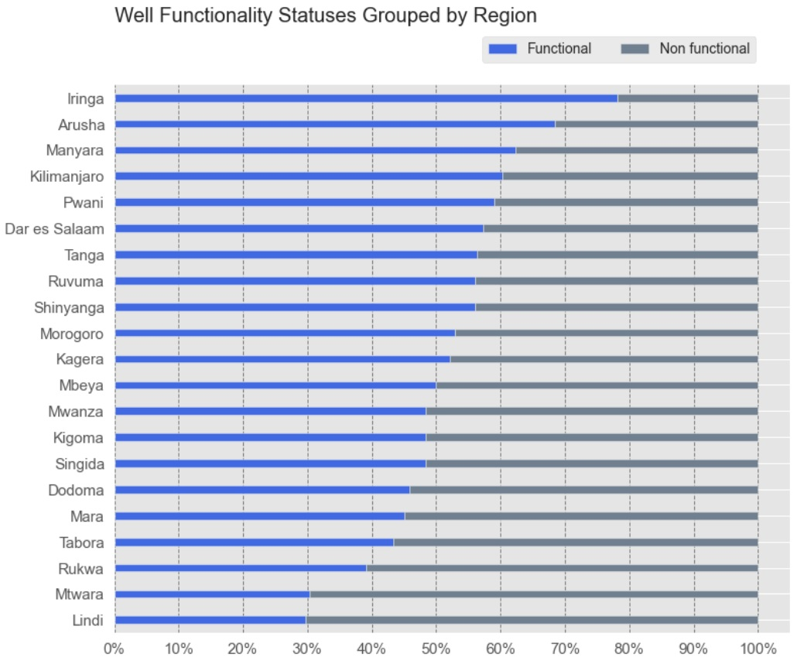

# Tanzania-Water-Well-Project

## Overview 

Tanzania is in the midst of a water crisis: some of the people in the country do not have access to a source of safe water, and most of the people lack access to improved sanitation.Peoples in Tanzania lives in poverty for reaching safe water which is human body's basic need. They are sometimes making significant traveling with long time distances to reach water.

The objective of this project is to use a powerful ensemble method to perform a **classification** of the functionality of the water wells in Tanzania.

## Business Problems

Almost half the population of Tanzania is without basic access to safe water. Although there are many waterpoints already established in the country, a lot of them are in need of repair while others have failed altogether. 

In this model, aim is the predict **functionality** of water points. This will help Tanzania Government for future work.
If a water point needs repair or why is not functional and what features affect functionality. With this model, we can help the Tanzanian authorities how to use water sources in a productive way.

## Dataset

The dataset provided on https://www.drivendata.org by **Taarifa** and the **Tanzanian Ministry of Water**.
Dataset has 59,400 entries and 40 columns and after preparing data to modeling we have 168 features.

    We have data from 1960 to 2013 with different funders at 21 different regions in Tanzania. 

    Also it has water quality as ; soft and bad with waterpoint type as; communal pipe, hand pump etc.    

    We have the quantity of the water source as enough, insufficient,dry and seasonal,

    with source type as spring, shallow well, etc.
    
## Exploratory Data Analysis(EDA)

Our target variable(status_group)'s frequency is ;

    functional                 0.54304
    non functional             0.38429
    functional needs repair    0.07267

## Features 

### Quality

As we processed our water quality values as soft(convenient) and bad(not usable). It seems convenient water quality points needs improvement, because there is a big portion of non-functional water points. 

### Quantity

Communal standpipe and hand pump mostly preferred.

Communal standpipes with multiple types and others(dam,cattle trough) have mostly non-functional water points.

### Regions 

We can easily see the region which has mostly functional water points has the highest number of water point.

On the other hand less water point regions have mostly non-functinoal water points.

### Findings

This is our most important features; as our model predicted longitude,latitude most important features. After those, in order dry water quantity and enough water quantity comes. 

## Modeling 

The main metric that I would be using to assess my models' performance here is `F-1 Score`. F-1 score explain how good the quality of predictions are and how completely we've predicted labels from dataset.  We wouldn't look at accuracy score because it woudl be misleading for our specific project. Because accuracy generally good for balanced classes and if both classes importances the same. We are goin to look at **F-1 Score** because it is harmonic mean of precision and recall scores what exactly need for this porject.

### Pipeline

Used pipeline to make different models for this project. First; preprocessing as ohe(OneHotEncoder) for categorical columns and scaling(StandartScaler) for numerical columns. And then used ColumnTransformer. Next step is model;
    
    1. Logistic Regression Model Score : 0.72
    2. KNeighbors Classifier Score     : 0.77
    3. Random Forest Score             : 0.79
    4. Gradient Boosting Score         : 0.79
 
Also used grid search for models to find best parameters and getting better score.

As we can see best results at Random Forest and Gradient Boosting Scores.

#### Random Forest 

#### Gradient Boosting

At these confusion metrics `1` is `Non-functional` and `0` is `Functional` water points. We did these feature engineering because we wanted to focus on non-functional water points to make them functional or to find why they are non-functional. 
